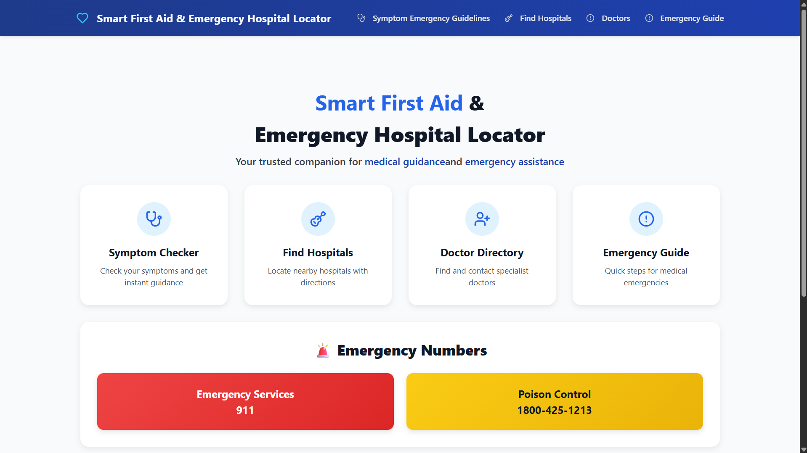
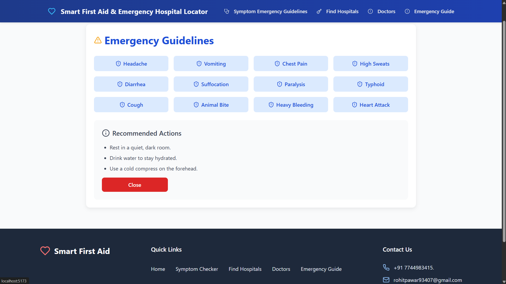
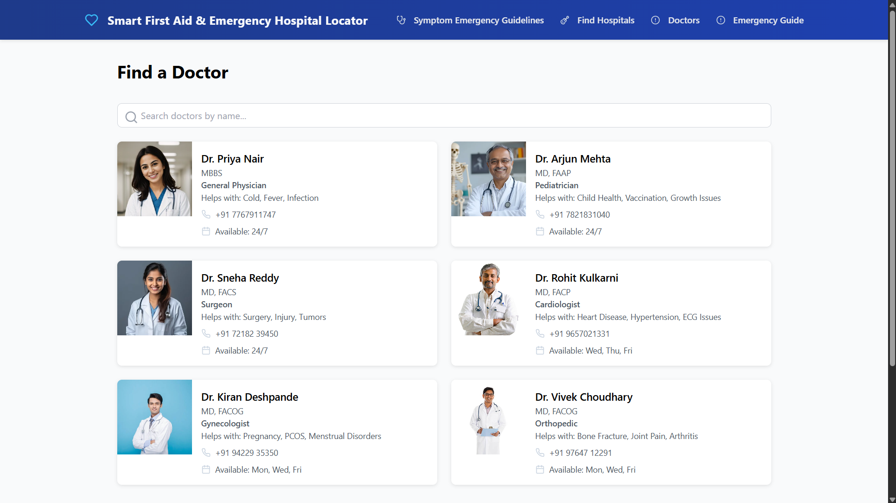
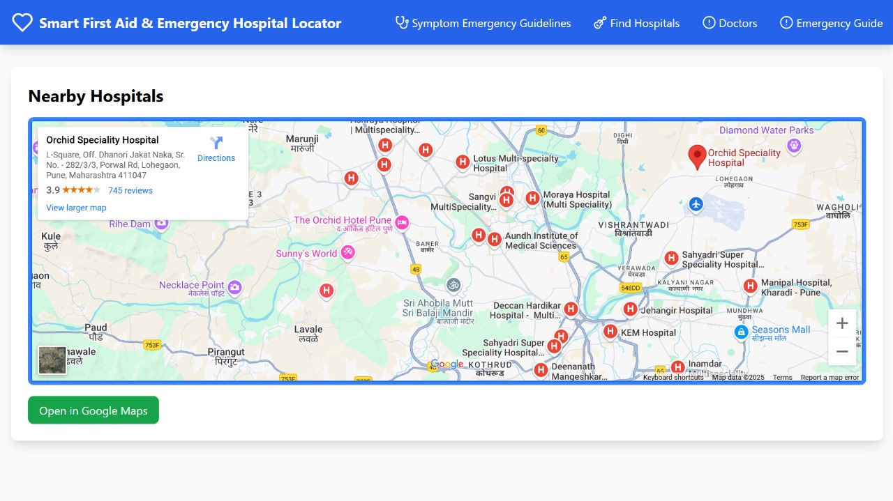
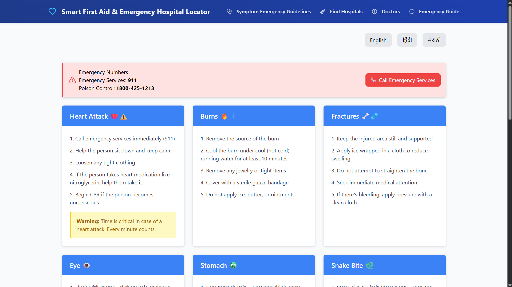

# Smart First Aid & Emergency Hospital Locator 🏥🩺

**Developed By:** SE AIDS Department, Marathwada Mitra Mandal's Institute of Technology, Lohgaon, Pune  

---


## Author

- [@rohitpawar43](https://github.com/rohitpawar43)

---

## Team Members

| Name               | Role / Contribution                     |
|-------------------|----------------------------------------|
| Rohit Pawar        | Frontend & React Implementation        |
| Vaishnavi Shendge  | Backend & Database Integration         |
| Payal Karvande     | UI/UX Design & Testing                 |
| Pratiksha Raskar   | API Integration & Documentation        |

---

## Project Overview

Smart First Aid & Emergency Hospital Locator is a **React-based application** designed to help users **locate nearby hospitals quickly** and provide **emergency first aid guidance**.  

Key objectives:  
- Real-time hospital locator  
- Symptom-based emergency advice  
- Doctor directory with contact details  
- Interactive first aid instructions  

This project enhances healthcare accessibility and helps users respond **promptly in emergency situations**.

---


## Features / Activities

- Real-time hospital locator using **Google Maps API**  
- Symptom-based emergency guidance  
- Doctor directory with search functionality  
- Step-by-step first aid instructions  
- User-friendly and responsive interface  
- Emergency contact information  

---

## Tech Stack

- **Frontend:** React.js & CSS
- **Backend:** Node.js & Express.js   
- **Database:** Firebase / MongoDB  
- **APIs:** Google Maps API    


------

## Screenshots

### Home Page  
  

---

### Symptom Emergency Guidelines  
  

---

### Doctors Directory  
  

---

### Hospital Locator  
  

---


### Emergency Guide  
  

---


## Running Tests

To run tests, run the following command

```bash
  npm run dev
```


